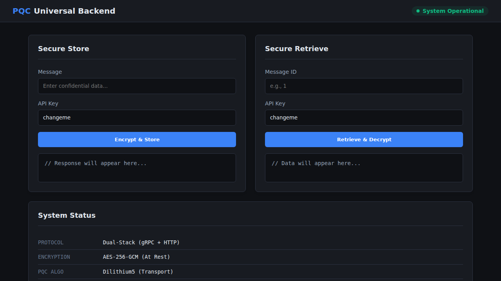

# Universal PQC Backend

**Secure. Scalable. Quantum-Safe.**

The **Universal PQC Backend** is an industrial-grade secure storage and messaging platform designed for the post-quantum era. It leverages **CRYSTALS-Dilithium5** for quantum-resistant transport security and **AES-256-GCM** for encryption-at-rest, ensuring data remains confidential against both classical and future quantum threats.

The system features a **Dual-Stack Architecture**, serving high-performance **gRPC** (for CLI and system integration) and **HTTP/REST** (for web clients) simultaneously.



## Core Features

*   **Quantum-Safe Transport:** All communication is secured using a custom OpenSSL build with **Dilithium5** signatures and **Kyber** key encapsulation (via OQS-OpenSSL 1.1.1).
*   **Encrypted Persistence:** Data is stored in a robust SQLite database, transparently encrypted with **AES-256-GCM**.
*   **Dual-Stack API:**
    *   **gRPC (Port 50051):** High-throughput, strongly typed interface for internal services.
    *   **HTTP/REST (Port 8080):** Universal gateway for web apps, secured with API Keys.
*   **Cloud Scalability:** Built-in support for offloading large encrypted files to **AWS S3** (or MinIO).
*   **Secure File Transfer:** Streaming upload/download capabilities with automatic encryption.
*   **Operational Dashboard:** A real-time, dark-themed control panel for system monitoring and data management.

## Architecture

The system is built as a hybrid C++/Python application containerized with Docker:

*   **Server (C++):** Core logic, cryptographic operations, DB management, and S3 client.
*   **Client (Python):** A CLI tool for interacting with the server via gRPC.
*   **Libraries:** `liboqs`, `OQS-OpenSSL`, `gRPC`, `nlohmann/json`, `cpp-httplib`.

## Installation

The entire system is containerized. Building the image compiles the full custom cryptographic toolchain.

### Prerequisites
*   Docker & Docker Compose (optional)
*   Linux Environment (Ubuntu 20.04+ recommended)

### Build & Run
The included `setup.sh` script handles building the Docker image, generating PQC certificates, and running integration tests.

```bash
./setup.sh
```

To run the server manually after building:

```bash
docker run -d --name pqc-server \
  -p 50051:50051 -p 8080:8080 \
  -v "$(pwd)/certs:/app/certs" \
  -v "$(pwd)/data:/app/data" \
  pqc-server
```

## Usage

### 1. Web Dashboard
Access the secure dashboard at **`http://localhost:8080`**.
*   **Status:** View real-time server health and active protocols.
*   **Store/Retrieve:** Encrypt and store messages directly from the browser.
*   **Default API Key:** `changeme` (Configure in `config.json`).

### 2. CLI Client
The Python CLI is installed within the container or can be installed locally.

**Option A: Install via PyPI**
Once published, you can install the client directly:
```bash
pip install pqc-client
```

**Option B: Manual Usage**
```bash
# Inside the container
docker exec -it pqc-server pqc-client --help
```

**Store a Message:**
```bash
pqc-client store "Top Secret Payload"
```

**Upload a Secure File:**
```bash
pqc-client upload-file ./confidential.pdf
```

**Retrieve a Message:**
```bash
pqc-client retrieve <MESSAGE_ID>
```

## Configuration

Configuration is managed via `config.json`.

```json
{
  "address": "0.0.0.0:50051",
  "storage_path": "data/storage.bin",
  "http_api_key": "your-secure-api-key",
  "use_s3": false,
  "s3_bucket": "my-secure-bucket",
  "s3_region": "us-east-1"
}
```

## License

Copyright (c) 2024. All rights reserved.
Licensed under the Apache License, Version 2.0.

## Contributing

We are actively seeking:
*   **Testers:** To verify the system on various Linux distributions (Fedora, Arch, Debian) and report build/runtime issues.
*   **Contributors:** To help implement additional PQC algorithms (e.g., Falcon, SPHINCS+) and enhance the S3 integration.

Please submit issues and pull requests to help make post-quantum security accessible to everyone.

## Acknowledgments & Legal

This project stands on the shoulders of giants. We explicitly credit the following open-source projects:

*   **[Open Quantum Safe](https://openquantumsafe.org/):** For `liboqs` and the OQS-OpenSSL fork. (MIT License)
*   **[gRPC](https://grpc.io/):** For the high-performance RPC framework. (Apache 2.0 License)
*   **[nlohmann/json](https://github.com/nlohmann/json):** For JSON parsing. (MIT License)
*   **[cpp-httplib](https://github.com/yhirose/cpp-httplib):** For the HTTP/REST gateway. (MIT License)
*   **[SQLite](https://www.sqlite.org/):** For the database engine. (Public Domain)


Special thanks to [@Mester-Oxdan](https://github.com/Mester-Oxdan) for providing the system and compilation support!


**Disclaimer:** While this project uses **NIST-selected algorithms** (CRYSTALS-Dilithium), the software itself has not undergone FIPS 140-3 certification. It is intended for industrial research and forward-looking security implementation.
